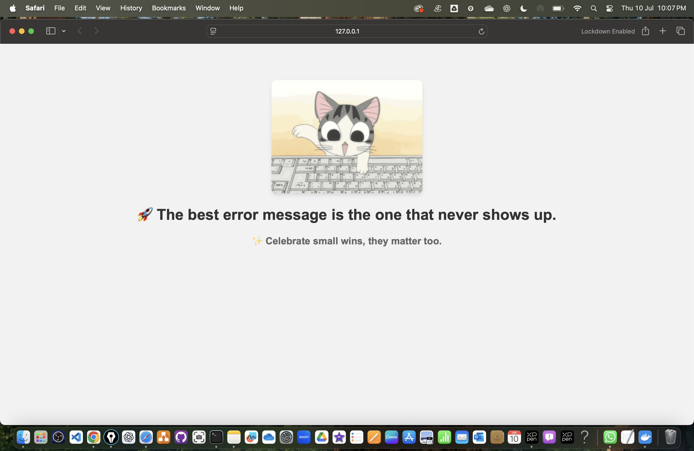

## 📦 Project Structure

```
minikube-quotes-app/
├── app.py
├── Dockerfile
├── requirements.txt
├── k8s/
│   ├── deployment.yaml
│   └── service.yaml
└── README.md
```
```
cd Downloads
git clone https://github.com/atulkamble/minikube-quotes-app.git
cd minikube-quotes-app
```
## 📸 Screenshots

### 🖥️ App Interface  


---

## minikube start 
```
minikube start
```
---

## **minikube-quotes-app**

````markdown
# 📖 Minikube Quotes App 🚀

A lightweight Python Flask web app serving random developer wisdom quotes, EQ reflections, and coding GIFs — deployable easily on **Docker** and **Minikube (Kubernetes)**!

---

## 📦 Features

- 📝 30 developer wisdom quotes
- 🎨 20 coding-themed GIFs
- 💖 10 EQ affirmations
- 🔄 No immediate GIF repeats
- 📄 JSON API endpoint
- 📊 Health check route
- 🐳 Docker container support
- ☸️ Minikube-ready Kubernetes deployment

---

## 📥 Local Installation & Usage

### 📦 Install dependencies

```bash
pip install -r requirements.txt
````

### ▶️ Run locally

```bash
python app.py
```

Visit: `http://localhost:5000/`

---

## 🐳 Docker Deployment

### 📦 Build and Push Docker image

```bash
docker build -t atuljkamble/minikube-quotes-app .
docker push atuljkamble/minikube-quotes-app
```

### ▶️ Run Docker container

```bash
docker run -d -p 5000:5000 atuljkamble/minikube-quotes-app
```

Visit: `http://localhost:5000/`

---

## ☸️ Minikube Kubernetes Deployment

### 📦 Load Docker image into Minikube

```bash
minikube image load minikube-quotes-app:latest
```

### 📄 Apply Kubernetes manifests

```bash
kubectl apply -f k8s/
```

### 📊 Expose the service

```bash
minikube service minikube-quotes-service
```

It will open your app in the browser.

---

## 📑 JSON API Endpoints

* `http://localhost:5000/?format=json`
* `http://localhost:5000/health`

---

## 📚 Project Structure

```
minikube-quotes-app/
├── app.py
├── Dockerfile
├── requirements.txt
├── k8s/
│   ├── deployment.yaml
│   └── service.yaml
└── README.md
```

---

```
minikube dashboard
```
```
minikube service minikube-quotes-service

```
# Commands
```
// docker desktop 

// for ec2 | refer https://github.com/atulkamble/ec2-minikube

// from your local machine 

cd Downloads
git clone https://github.com/atulkamble/minikube-quotes-app.git
cd minikube-quotes-app
cd app
// manually run app

python3 app.py

docker login 

// build image and push to dockerhub 

docker build -t atuljkamble/minikube-quotes-app .
docker push atuljkamble/minikube-quotes-app

// locally create container 

docker run -d -p 5000:5000 atuljkamble/minikube-quotes-app

// access from browser 

http://localhost:5000/

// stop container 

docker container stop b6c3480f212f

// start k8s cluster 

minikube start

minikube addons enable metrics-server

minikube dashboard 

// update your dockerhub username in k8s/deployment.yaml

// apply yaml templates 

kubectl apply -f k8s

// list nodes, deployments,, services, pods 

kubectl get nodes
kubectl get deployments
kubectl get pods
kubectl get svc

kubectl get all 

minikube service minikube-quotes-service

// open output in browser 

http://127.0.0.1:50891

minikube ip

```

# on ec2-minikube
```
sudo yum update -y
sudo yum install git -y
git config --global user.name "Atul Kamble"
git config --global user.email "atul_kamble@hotmail.com"
git config --list 
sudo yum install git -y
sudo yum install docker -y 
sudo systemctl start docker
sudo systemctl enable docker 

curl -LO "https://storage.googleapis.com/kubernetes-release/release/$(curl -s https://storage.googleapis.com/kubernetes-release/release/stable.txt)/bin/linux/amd64/kubectl"
chmod +x kubectl
sudo mv kubectl /usr/local/bin/

curl -LO https://storage.googleapis.com/minikube/releases/latest/minikube-linux-amd64
sudo install minikube-linux-amd64 /usr/local/bin/minikube

sudo usermod -aG docker $USER && newgrp docker

minikube status
kubectl get nodes
kubectl get pods -A

minikube start --driver=docker --cpus=2 --memory=4096
OR
minikube start
minikube addons enable default-storageclass
minikube addons enable storage-provisioner
minikube addons enable metrics-server
minikube addons enable dashboard
minikube addons enable metrics-server
git clone https://github.com/atulkamble/minikube-quotes-app.git
cd minikube-quotes-app/
sudo docker login
docker build -t atuljkamble/minikube-quotes-app .
docker push atuljkamble/minikube-quotes-app
sudo docker push atuljkamble/minikube-quotes-app
kubectl apply -f k8s/
minikube service minikube-quotes-service
wget http://192.168.49.2:30080
cat index.html 
minikube stop 
minikube delete 

```
---

# on ubuntu 
```
sudo apt update -y
sudo apt install python3-pip
sudo apt install python3-venv -y  
python3 -m venv flaskenv
source flaskenv/bin/activate
pip install flask
git clone https://github.com/atulkamble/minikube-quotes-app.git
cd minikube-quotes-app/app
python app.py
```

# on minikube 
```
git --version 
git clone https://github.com/atulkamble/minikube-quotes-app
cd minikube-quotes
cd app 
python3 app.py 

>> localhost:5000 

sudo docker build -t atuljkamble/minikube-quotes-app .

sudo docker images 

docker rmi 58ca53aae955 -f

docker pull atuljkamble/minikube-quotes-app:latest

sudo docker run -d -p 5000:5000 atuljkamble/minikube-quotes-app

sudo docker container ls

sudo docker container stop 987b211c6be3

minikube start

minikube dashboard 

kubectl apply -f /k8s/deployment.yaml

kubectl apply -f /k8s/minikube-service.yaml

kubectl get svc 

http://127.0.0.1:5000/


